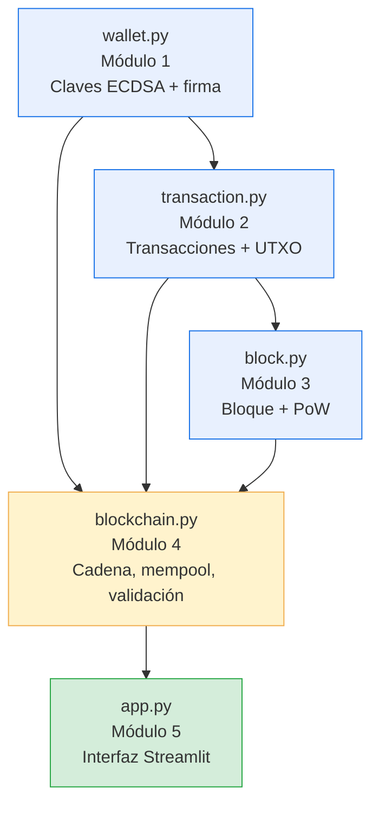
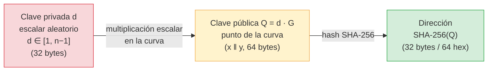
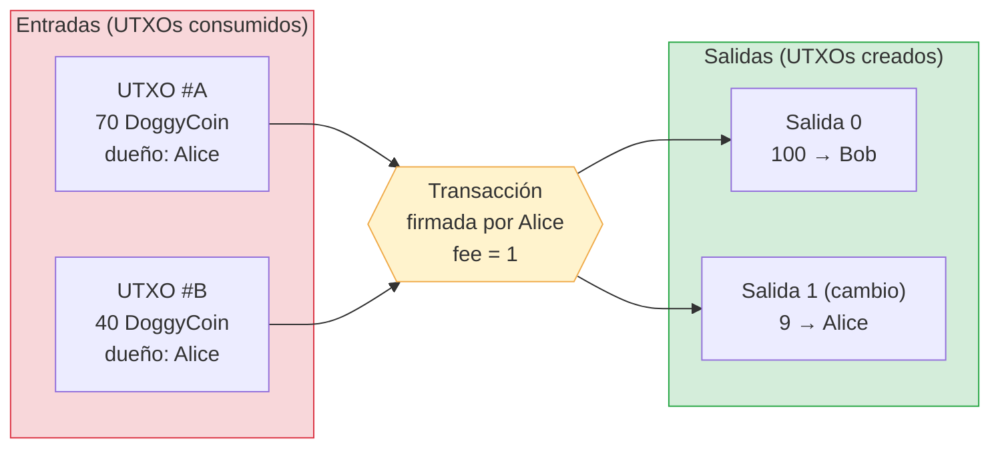
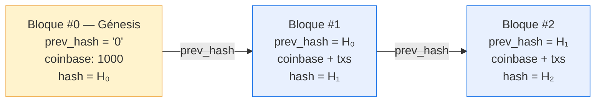
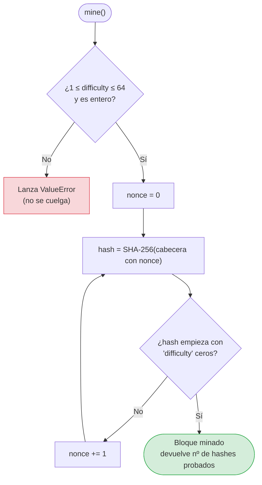
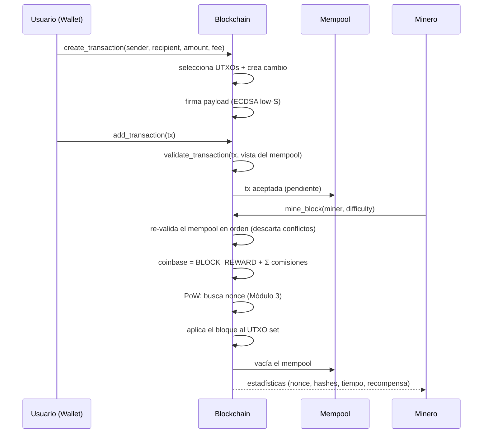

# DoggyCoin — Mini-blockchain educativa

Proyecto Integrador de la materia **Desarrollo de proyectos de ingeniería matemática** (código **MA3001B.501**).

**DoggyCoin** es una criptomoneda educativa, implementada íntegramente en Python, que reproduce de forma autocontenida los mecanismos fundamentales de una cadena de bloques real: pares de llaves de **criptografía de curva elíptica (ECDSA sobre secp256k1)**, **firmas digitales** de las transacciones, el **modelo contable UTXO** (*Unspent Transaction Output*), **bloques encadenados por hash**, un **bloque génesis con premine**, **minería mediante Prueba de Trabajo (PoW)** y una **interfaz interactiva en Streamlit** para operar y visualizar el sistema completo.

El objetivo no es construir una moneda de producción, sino **demostrar y verificar** —con código legible y pruebas— los invariantes que hacen que una blockchain sea consistente: imposibilidad de gastar dinero ajeno (firmas), imposibilidad de gastar dos veces (UTXO + mempool), conservación del valor (no se crea dinero salvo en la coinbase) e inmutabilidad de la historia (encadenamiento por hash + PoW).

## Autores

| Nombre | Matrícula |
|--------|-----------|
| Andrés Felipe García Viña | A01800027 |
| Rodrigo Lira del Ángel | A01799277 |
| Diego Jesús Lara de la Cruz | A01748449 |

---

## Tabla de contenidos

1. [Arquitectura del sistema](#arquitectura-del-sistema)
2. [Instalación y ejecución](#instalación-y-ejecución)
3. [Módulo 1 — Wallets y claves (ECDSA / secp256k1)](#módulo-1--wallets-y-claves-ecdsa--secp256k1)
4. [Módulo 2 — Transacciones y modelo UTXO](#módulo-2--transacciones-y-modelo-utxo)
5. [Módulo 3 — Bloques y Prueba de Trabajo](#módulo-3--bloques-y-prueba-de-trabajo)
6. [Módulo 4 — Blockchain: génesis, minería y validación](#módulo-4--blockchain-génesis-minería-y-validación)
7. [Módulo 5 — Interfaz Streamlit](#módulo-5--interfaz-streamlit)
8. [Reglas económicas e invariantes](#reglas-económicas-e-invariantes)
9. [Endurecimiento de seguridad](#endurecimiento-de-seguridad)
10. [Pruebas y verificación](#pruebas-y-verificación)
11. [Despliegue en Streamlit Community Cloud](#despliegue-en-streamlit-community-cloud)
12. [Limitaciones conocidas](#limitaciones-conocidas)
13. [Estructura del repositorio](#estructura-del-repositorio)

---

## Arquitectura del sistema

El proyecto está organizado como un paquete Python (`blockchain/`) con cuatro módulos de dominio más una capa de presentación (`app.py`). Cada módulo del enunciado se corresponde con un archivo, y las dependencias entre ellos forman un grafo acíclico: las capas superiores reutilizan las inferiores sin ciclos.



| Módulo | Archivo | Responsabilidad |
|--------|---------|-----------------|
| 1. Wallets y claves | `blockchain/wallet.py` | Par de llaves ECDSA secp256k1. Dirección = `SHA-256(clave pública)`. Firma determinista *low-S* y verificación. |
| 2. Transacciones y UTXO | `blockchain/transaction.py` | Entradas (`TxInput`), salidas (`TxOutput`), comisión, `txid`. Serialización canónica, payload de firma, coinbase. |
| 3. Bloques y blockchain | `blockchain/block.py` | Cabecera, hash SHA-256, `nonce`, `prev_hash`, dificultad. Prueba de Trabajo y su verificación. |
| 4. Génesis y minería | `blockchain/blockchain.py` | Génesis (premine 1000), conjunto de UTXOs, mempool, construcción/validación de transacciones, minería, validación íntegra de la cadena y persistencia JSON. |
| 5. Simulación | `app.py` | Interfaz Streamlit (Inicio, Usuarios, Transacciones, Minería, Blockchain, Balances). |

El paquete expone las clases principales desde `blockchain/__init__.py`, de modo que `from blockchain import Wallet, Transaction, Block, Blockchain` basta para usar el sistema desde código.

---

## Instalación y ejecución

Requisitos: **Python 3.11 o superior**. Dependencias declaradas en `requirements.txt`:

```
ecdsa>=0.19        # criptografía de curva elíptica (secp256k1)
streamlit>=1.30    # interfaz web
pandas>=2.0        # tablas en la interfaz
```

Instalación en un entorno virtual:

```bash
python3 -m venv .venv
source .venv/bin/activate        # Windows: .venv\Scripts\activate
pip install -r requirements.txt
```

Tres formas de ejecutar el proyecto:

```bash
streamlit run app.py        # 1) Interfaz gráfica (http://localhost:8501)
python demo.py              # 2) Demostración por consola de todos los módulos
python tests_seguridad.py   # 3) Pruebas de regresión de seguridad/robustez
```

---

## Módulo 1 — Wallets y claves (ECDSA / secp256k1)

> Archivo: `blockchain/wallet.py`

### El problema que resuelve

Para que nadie pueda gastar el dinero de otra persona, cada usuario debe poder **demostrar que es el dueño** de unos fondos sin revelar ningún secreto reutilizable. La solución universal es la **criptografía asimétrica**: cada usuario posee un par de llaves matemáticamente ligadas entre sí —una privada y una pública— tal que firmar requiere la privada, pero verificar la firma solo requiere la pública.

DoggyCoin usa **ECDSA** (*Elliptic Curve Digital Signature Algorithm*) sobre la curva **secp256k1**, la misma que emplean Bitcoin y Ethereum.

### La curva secp256k1

secp256k1 es la curva elíptica definida por la ecuación

```
y² = x³ + 7   (mod p)
```

sobre el cuerpo finito de los enteros módulo un primo muy grande:

```
p = 2²⁵⁶ − 2³² − 977
```

Los puntos `(x, y)` que satisfacen esa ecuación, junto con un "punto al infinito" que actúa como elemento neutro, forman un **grupo abeliano** bajo una operación de "suma de puntos" definida geométricamente (la recta que une dos puntos corta la curva en un tercero, que se refleja respecto al eje X). Sobre ese grupo se fija un **punto generador** `G` y un **orden** `n` (primo, de ~256 bits) que es la cantidad de puntos que `G` genera.

### Clave privada, clave pública y dirección

La derivación de identidad de un usuario es una cadena unidireccional:



- **Clave privada `d`**: un entero aleatorio en `[1, n−1]`. Es el único secreto del usuario. En el código es `SigningKey.generate(curve=SECP256k1)` y se expone en hex con `private_key_hex` (32 bytes).
- **Clave pública `Q = d · G`**: el resultado de "sumar" `G` consigo mismo `d` veces (multiplicación escalar). Es un punto de la curva que se serializa como la concatenación de sus coordenadas `x` e `y` (64 bytes), expuesto en `public_key_hex`.
- **Dirección**: en este proyecto se define como `SHA-256(clave pública)`, 32 bytes / 64 caracteres hexadecimales (`address`). Es el identificador público que aparece en las salidas de las transacciones.

La seguridad descansa en el **Problema del Logaritmo Discreto en Curvas Elípticas (ECDLP)**: dadas `Q` y `G`, recuperar `d` tal que `Q = d·G` es computacionalmente inviable. Por eso publicar `Q` (y por tanto la dirección) no compromete `d`. La función inversa "pública → privada" no existe en la práctica; la cadena de flechas del diagrama solo se puede recorrer hacia la derecha.

### Firma de un mensaje

Para autorizar un gasto, el dueño firma con su clave privada. El método `Wallet.sign` produce una firma ECDSA con dos propiedades deliberadas:

```python
signature = self.signing_key.sign_deterministic(
    message,
    hashfunc=hashlib.sha256,
    sigencode=sigencode_der_canonize,   # forma canónica low-S
)
```

1. **Determinista (RFC 6979)**: ECDSA exige un valor efímero `k` por firma; si `k` se repite o es predecible, la clave privada se filtra trivialmente (es el fallo que comprometió la PlayStation 3). RFC 6979 deriva `k` de forma determinista a partir del mensaje y la clave privada, eliminando la dependencia de un generador aleatorio.
2. **Canónica *low-S* (`sigencode_der_canonize`)**: una firma ECDSA es un par `(r, s)`. Por la simetría del grupo, si `(r, s)` es válida, también lo es `(r, n − s)`. Esa **maleabilidad** permitiría a un tercero alterar una firma sin invalidarla y, con ello, cambiar el identificador (`txid`) de la transacción. La forma canónica fuerza `s ≤ n/2`, dejando una única firma válida por mensaje.

La firma se devuelve codificada en **DER** y representada en hexadecimal.

### Verificación

`verify_signature(public_key_hex, signature_hex, message)` reconstruye la clave pública y comprueba la firma, **rechazando además las firmas no canónicas (*high-S*)**:

```python
_r, s = sigdecode_der(sig, SECP256k1.order)
if s > _HALF_ORDER:          # _HALF_ORDER = n // 2
    return False             # firma maleada: rechazada
```

Cualquier error (clave mal formada, firma inválida, `s` fuera de rango) se traduce en `False`, nunca en una excepción que pudiera interrumpir la validación de la cadena.

---

## Módulo 2 — Transacciones y modelo UTXO

> Archivo: `blockchain/transaction.py`

### El modelo UTXO

A diferencia de un sistema de "cuentas con saldo", una blockchain tipo Bitcoin no almacena un número por usuario. Almacena un conjunto de **salidas no gastadas (UTXOs)**: trozos indivisibles de dinero, cada uno con una cantidad y un dueño (dirección). El **saldo** de un usuario es, por definición, la suma de los UTXOs que tiene a su favor y que nadie ha gastado todavía:

```
saldo(dirección) = Σ { amount de cada UTXO cuyo dueño es la dirección }
```

Para gastar, una transacción **consume UTXOs completos como entradas** y **crea UTXOs nuevos como salidas**. Como las entradas son indivisibles, casi siempre sobra dinero, que se devuelve al emisor como una **salida de cambio** (igual que pagar 100 con un billete de 200 y recibir 100 de vuelta).



En el ejemplo, las entradas suman `70 + 40 = 110`. Se pagan `100` a Bob, la comisión es `1`, y el cambio es `110 − 100 − 1 = 9` de vuelta a Alice. Se cumple la **ecuación de conservación**:

```
Σ entradas = Σ salidas + comisión        →    110 = (100 + 9) + 1
```

### Anatomía de una transacción

Una `Transaction` se compone de:

- **`inputs`** (`TxInput`): cada entrada referencia un UTXO existente por `txid:index`, e incluye la **clave pública** del que gasta y su **firma**.
- **`outputs`** (`TxOutput`): cada salida tiene una `amount` y la `address` del receptor.
- **`fee`**: comisión opcional que se queda el minero que incluya la transacción.
- **`txid`**: hash SHA-256 de todo el contenido; identifica la transacción de forma única.
- **`coinbase_data`**: marca opcional que distingue las transacciones especiales de creación de moneda (ver más abajo).

### Dos hashes con propósitos distintos

El módulo separa cuidadosamente **qué se firma** de **qué identifica** a la transacción, usando una serialización JSON canónica (`sort_keys=True`, sin espacios) que garantiza que dos estructuras iguales producen exactamente los mismos bytes:

- **`signing_payload()`** — lo que firma cada entrada. Compromete las *referencias* a los UTXOs gastados (`txid` + `index`), todas las salidas, la comisión y `coinbase_data`, **pero no las firmas ni las claves** (incluirlas crearía una dependencia circular: la firma no puede firmarse a sí misma). Así, alterar a quién o cuánto se paga invalida la firma.
- **`compute_txid()`** — el identificador. Hashea **todo** el contenido, incluidas firmas y claves públicas. Por eso, tras firmar, se llama a `refresh_txid()` para fijar el `txid` definitivo.

### Transacción coinbase

La **coinbase** es la única transacción que crea dinero de la nada: no tiene entradas y su salida es la recompensa (el premine del génesis o la recompensa de un bloque). La propiedad que la distingue es estricta:

```python
@property
def is_coinbase(self) -> bool:
    return self.coinbase_data is not None and len(self.inputs) == 0
```

La exigencia de **cero entradas** es deliberada: una transacción que se "declare" coinbase pero traiga entradas **no** se considera coinbase, de modo que la validación de la cadena la rechaza en lugar de permitir que "queme" UTXOs ajenos sin firmarlos. El campo `coinbase_data` (p. ej. `"genesis"` o `"block-3"`) también hace único el `txid` aunque dos recompensas sean idénticas en monto.

---

## Módulo 3 — Bloques y Prueba de Trabajo

> Archivo: `blockchain/block.py`

### Estructura del bloque

Un `Block` agrupa transacciones y se encadena con el anterior. Su **cabecera** (lo que se hashea) contiene:

| Campo | Significado |
|-------|-------------|
| `index` | Posición en la cadena (0 = génesis). |
| `timestamp` | Momento de minado (epoch); se guarda tal cual para que el hash sea reproducible al recargar. |
| `prev_hash` | Hash del bloque anterior: el eslabón que une la cadena. |
| `difficulty` | Número de ceros hexadecimales iniciales que exige la PoW. |
| `nonce` | Número que se ajusta hasta cumplir la PoW. |
| `tx_ids` | Lista de los `txid` de las transacciones del bloque. |

Incluir los `txid` (y no las transacciones completas) en la cabecera es suficiente para la integridad: como cada `txid` es el hash de toda su transacción, cualquier modificación de una transacción cambia su `txid`, cambia la cabecera y cambia el hash del bloque. El hash del bloque es `SHA-256` de la cabecera serializada canónicamente.

### Encadenamiento e inmutabilidad

Cada bloque referencia el hash del anterior. Como ese hash depende de todo el contenido del bloque previo, modificar un bloque antiguo cambia su hash, lo que rompe el `prev_hash` del siguiente, y así en cascada hasta el final de la cadena. Reescribir la historia obliga, por tanto, a **re-minar todos los bloques posteriores**.



### Prueba de Trabajo (PoW)

La PoW convierte la "reescritura de la historia" en algo **costoso**. Minar consiste en encontrar un `nonce` tal que el hash del bloque empiece con `difficulty` ceros:



Como SHA-256 es una función pseudoaleatoria, cada carácter hexadecimal del hash es uniforme sobre 16 valores. La probabilidad de que un hash cualquiera empiece con `d` ceros es `(1/16)^d`, de modo que el **número esperado de intentos** crece exponencialmente:

```
E[hashes] ≈ 16^d        d = 3 → ~4 096        d = 6 → ~16.7 millones
```

Por eso la interfaz advierte que una dificultad 1–3 es rápida y 5–6 puede tardar. La búsqueda de `nonce` es incremental y exhaustiva (`0, 1, 2, …`), por lo que es determinista y siempre termina para una dificultad alcanzable.

Dos salvaguardas importantes en `mine()`:

- La dificultad debe ser un **entero entre 1 y 64** (un hash SHA-256 en hex tiene 64 caracteres; exigir 65 ceros sería imposible y el minado nunca terminaría). Fuera de rango se lanza `ValueError` en lugar de colgarse.
- `is_valid_pow()` comprueba **dos** cosas: que el hash almacenado es realmente el del contenido (`hash == compute_hash()`) **y** que cumple la dificultad declarada. No basta con que "parezca" minado.

---

## Módulo 4 — Blockchain: génesis, minería y validación

> Archivo: `blockchain/blockchain.py`

Esta clase es el orquestador. Mantiene cuatro estructuras: la `chain` (lista de bloques), el `utxos` (conjunto de UTXOs no gastados, indexado por `"txid:index"`), el `mempool` (transacciones válidas pendientes) y las `wallets` conocidas. Sus parámetros económicos están en la cabecera del archivo:

```python
COIN_NAME = "DoggyCoin"
GENESIS_SUPPLY = 1000.0    # premine del bloque génesis
BLOCK_REWARD = 3.0         # recompensa fija por bloque
DEFAULT_DIFFICULTY = 3     # ceros iniciales exigidos por la PoW
MIN_DIFFICULTY = 1         # piso de dificultad de consenso
AMOUNT_TOLERANCE = 1e-9    # tolerancia de coma flotante (< precisión 1e-8)
```

### Bloque génesis y premine

`Blockchain.create()` genera una **wallet fundadora** ("Génesis") y construye el bloque génesis: una única coinbase que premina **1000 DoggyCoin** a su favor (`prev_hash = "0"`). Es el único dinero "creado de la nada" fuera de las recompensas de minería; desde la fundadora se financia al resto de usuarios.

### Construcción de una transacción

`create_transaction(sender, recipient, amount, fee)` automatiza el modelo UTXO:

1. Valida que la cantidad sea positiva, la comisión no negativa y que el destinatario **no sea el propio remitente** (no se permite el auto-envío).
2. Calcula lo necesario (`amount + fee`) y selecciona UTXOs del remitente con una estrategia *greedy* hasta cubrirlo, sobre una **vista proyectada** del mempool (ver abajo).
3. Crea la salida al receptor y, si sobra, una salida de **cambio** al remitente.
4. Firma el `signing_payload` con la clave privada del emisor y fija el `txid`.

### Mempool y gasto del cambio no confirmado

`_mempool_view()` parte del UTXO set confirmado y aplica, en orden, todas las transacciones pendientes (gastando sus entradas y añadiendo sus salidas). Gracias a ello una transacción puede **gastar el cambio aún no confirmado de otra** —como en Bitcoin— y se impide el doble gasto entre transacciones del mempool. `add_transaction()` valida cada nueva transacción contra esa vista antes de aceptarla.

### Validación de una transacción

`validate_transaction()` es la guardia de seguridad. Rechaza una transacción si:

- declara `coinbase_data` (una transacción normal nunca puede hacerlo: sería una coinbase encubierta);
- no tiene entradas o no tiene salidas;
- su `txid` no coincide con su contenido (transacción alterada);
- repite una entrada (doble gasto dentro de la misma transacción);
- referencia un UTXO inexistente o ya gastado;
- la clave pública no hashea a la dirección dueña del UTXO (no eres el dueño);
- la firma es inválida o no canónica;
- alguna salida no es positiva, o la comisión es negativa;
- **no se conserva el valor**: `|Σ entradas − (Σ salidas + fee)| > tolerancia`.

### Minería de un bloque



`mine_block()` re-valida secuencialmente el mempool sobre una vista temporal (descartando cualquier transacción que haya quedado en conflicto), construye la **coinbase** con `BLOCK_REWARD + Σ comisiones`, mina el bloque (PoW) y solo entonces fija la dificultad del sistema, aplica el bloque al UTXO set real y vacía el mempool. La operación es **atómica**: si la dificultad fuese inválida, `mine()` lanza `ValueError` y el estado queda intacto.

### Validación íntegra de la cadena

`is_valid_chain()` reconstruye el UTXO set **desde cero** y reverifica todo: el génesis, el encadenamiento de hashes, el piso de dificultad, la PoW de cada bloque, la validez de cada transacción y la corrección estructural de cada coinbase (sin entradas, exactamente una salida positiva, monto exacto = recompensa + comisiones). Es la prueba de **inmutabilidad**: cualquier manipulación de un bloque pasado se detecta porque el estado derivado deja de cuadrar.

### Persistencia

`to_dict()` / `from_dict()` serializan el estado a JSON, y `save()` / `load()` lo escriben y leen. Al cargar, `from_dict` **reconstruye el UTXO set aplicando la cadena** (estado derivado, no confiado) y `load(verify=True)` ejecuta `is_valid_chain()`, lanzando `ValueError` si el archivo fue manipulado, en vez de exponer balances falsos.

---

## Módulo 5 — Interfaz Streamlit

> Archivo: `app.py`

La interfaz web permite operar el sistema completo desde el navegador. La navegación está en la barra lateral (`st.sidebar`), junto con los autores y los controles de estado. El estado vive en `st.session_state`, de modo que **cada visitante tiene su propia cadena** (importante para el despliegue en la nube, cuyo disco es efímero y compartido).

| Sección | Qué hace |
|---------|----------|
| **Inicio** | Métricas del sistema (bloques, transacciones, supply, premine, recompensas, usuarios, mempool, dificultad) y verificación en vivo de la validez de la cadena. Muestra el supply esperado `1000 + 3 × (bloques − 1)`. |
| **Usuarios** | Crear wallets y consultar, por usuario, su clave privada, su clave pública y su dirección (advirtiendo que mostrar la privada solo es admisible en una simulación). |
| **Transacciones** | Construir, firmar y enviar transacciones al mempool, con remitente, destinatario, cantidad y comisión; muestra el mempool y el conjunto de UTXOs actual. |
| **Minería** | Elegir minero y dificultad (slider 1–6), minar un bloque y ver el nonce encontrado, los hashes probados, el tiempo y el desglose de la recompensa. |
| **Blockchain** | **Grafo de la cadena** (dibujado con `st.graphviz_chart`), tabla de bloques y detalle expandible de cada bloque y sus transacciones. |
| **Balances** | Tabla de saldos por usuario, gráfico de barras de la distribución y supply total en circulación. |

La barra lateral incluye además **descargar el estado a JSON** y **subirlo** después (validándolo antes de aplicarlo) y un botón de **reinicio con confirmación en dos pasos**. Así el trabajo se conserva entre visitas sin depender del disco del servidor.

---

## Reglas económicas e invariantes

El sistema mantiene, por construcción y por validación, los siguientes invariantes:

- **Creación de dinero acotada.** Solo las coinbase crean moneda: 1000 en el génesis y `3 + comisiones` por bloque. Ninguna transacción normal puede aumentar el dinero total.
- **Conservación del valor.** En toda transacción normal, `Σ entradas = Σ salidas + comisión`. La comisión no crea ni destruye dinero: cambia de manos del emisor al minero.
- **Supply determinista.** El total en circulación es exactamente

  ```
  supply = GENESIS_SUPPLY + BLOCK_REWARD × (nº de bloques − 1)
         = 1000 + 3 × (bloques minados)
  ```

- **Propiedad demostrable.** Gastar un UTXO exige una firma válida cuya clave pública hashea a la dirección dueña del UTXO.
- **No doble gasto.** Un UTXO se consume una sola vez; el mempool proyectado impide gastarlo dos veces antes de confirmar.
- **Inmutabilidad.** El encadenamiento por hash más la PoW hacen que reescribir un bloque pasado exija rehacer el trabajo de todos los posteriores.

---

## Endurecimiento de seguridad

Durante el desarrollo se realizaron varias rondas de revisión adversarial. Las defensas resultantes, todas verificadas con pruebas de regresión, son:

- **Coinbase estricta.** No puede tener entradas (no "quema" UTXOs ajenos), debe tener exactamente una salida positiva y pagar el monto exacto (`recompensa + comisiones`). Se cierra el reparto/redirección del premio y las salidas negativas.
- **Predicado coinbase unificado.** El mismo criterio (`is_coinbase`: con `coinbase_data` y sin entradas) se usa tanto al validar como al aplicar transacciones al UTXO set. Esto cierra un vector de inflación en el que una transacción con entradas *y* `coinbase_data` podría no gastar sus entradas.
- **Piso de dificultad de consenso.** Ningún bloque puede declarar una dificultad inferior a `MIN_DIFFICULTY`, impidiendo "rebajar" la PoW (p. ej. a 0) para reescribir la cadena barata. La dificultad forma parte del hash, así que no puede falsificarse sin re-minar.
- **Firmas no maleables.** Firma determinista (RFC 6979) y canónica *low-S*; la verificación rechaza explícitamente las firmas *high-S*.
- **Tolerancia menor que la precisión.** Las cantidades se redondean a `1e-8` y se comparan con tolerancia `1e-9`, de modo que la tolerancia solo absorbe ruido de coma flotante y no permite desbalances representables (inflación o quema encubierta por redondeo).
- **Carga validada.** `Blockchain.load` valida el estado al cargarlo y rechaza ficheros manipulados en lugar de mostrar balances envenenados.

---

## Pruebas y verificación

**`demo.py`** — recorre de principio a fin todos los módulos con asserts: genera ≥2 usuarios (mostrando sus claves), premina 1000 a la fundadora, financia a Alice y Bob (incluido el gasto de cambio no confirmado), mina con recompensa `3 + comisiones`, comprueba la conservación del supply y demuestra la **inmutabilidad** alterando un bloque y verificando que la cadena se invalida.

**`tests_seguridad.py`** — 12 pruebas de regresión, cada una reproduce un ataque o defecto y verifica que ahora se rechaza:

| Prueba | Qué verifica |
|--------|--------------|
| `test_coinbase_con_entradas_rechazada` | Una coinbase con entradas (quemar UTXOs ajenos) invalida la cadena. |
| `test_coinbase_dividida_rechazada` | Repartir/redirigir la recompensa en varias salidas se rechaza. |
| `test_coinbase_negativa_rechazada` | Una coinbase que paga de más se rechaza. |
| `test_tx_con_coinbase_data_rechazada` | Una transacción normal con `coinbase_data` (inflación) se rechaza en validación, mempool y cadena. |
| `test_piso_dificultad` | Bajar la dificultad a 0 y re-minar no da la cadena por válida. |
| `test_mine_dificultad_imposible` | Minar con dificultad ≥ 65 lanza `ValueError` (no se cuelga). |
| `test_malleabilidad_low_s` | Una firma *high-S* (maleada) es rechazada. |
| `test_conservacion_fraccionaria` | Montos fraccionarios no queman valor (supply exacto). |
| `test_inflacion_rechazada` | Inflar ~`1e-7` (dentro de la antigua tolerancia) ahora se rechaza. |
| `test_load_valida_estado_manipulado` | `load()` rechaza un estado manipulado. |
| `test_no_autoenvio` | No se puede crear una transacción a la propia dirección. |
| `test_roundtrip_valido` | Un estado legítimo se guarda y se carga correctamente. |

```bash
python demo.py
python tests_seguridad.py
```

---

## Despliegue en Streamlit Community Cloud

1. Sube el proyecto a un repositorio de GitHub con `app.py`, la carpeta `blockchain/` y `requirements.txt` en la raíz.
2. Entra en [share.streamlit.io](https://share.streamlit.io) y conéctate con GitHub.
3. **New app** → elige repositorio y rama; *Main file path* = `app.py`.
4. (Opcional) En *Advanced settings* fija la versión de Python.
5. **Deploy**. La primera vez instala las dependencias de `requirements.txt`.

No hace falta `packages.txt`: el grafo de la cadena se dibuja con `st.graphviz_chart` del lado del cliente, sin el binario de Graphviz. El estado es por sesión (no se comparte entre visitantes); usa los botones de descargar/subir JSON de la barra lateral para conservar la cadena entre visitas.

**Nota operativa:** al hacer `git push`, Streamlit Cloud suele aplicar un *hot-reload* que solo re-ejecuta `app.py`. Si editas un **módulo importado** (la carpeta `blockchain/`), puede quedar una versión antigua cacheada en memoria; en ese caso, un **Reboot app** (Manage app → menú ⋮ → Reboot app) reinicia el proceso y recarga todo el código nuevo.

---

## Limitaciones conocidas

Este es un proyecto educativo; sus límites son intencionales y se documentan honestamente:

- **PoW de baja dificultad.** Para que la demo sea ágil, la dificultad es baja, así que *re-minar* bloques es barato. Como en cualquier PoW, la inmutabilidad real depende de que rehacer el trabajo sea costoso; con dificultad alta el coste crece exponencialmente (`16^d`).
- **Claves privadas en claro.** Para poder firmar en la simulación, las claves privadas se guardan y se muestran en claro. En un sistema real nunca deberían salir del dispositivo del usuario.
- **Sin red P2P ni consenso distribuido.** Hay una sola cadena en memoria; no hay propagación entre nodos ni resolución de bifurcaciones.
- **Aritmética con `float`.** Se mitiga con redondeo a `1e-8` y validación de conservación, pero una moneda de producción usaría enteros (la unidad mínima, como los *satoshis*).

No usar en producción.

---

## Estructura del repositorio

```
.
├── app.py                  # Módulo 5: interfaz Streamlit
├── demo.py                 # Demostración por consola de todos los módulos
├── tests_seguridad.py      # Pruebas de regresión de seguridad/robustez
├── requirements.txt        # Dependencias (ecdsa, streamlit, pandas)
├── README.md               # Este documento
└── blockchain/             # Paquete con los módulos de dominio
    ├── __init__.py         # Exporta Wallet, Transaction, Block, Blockchain
    ├── wallet.py           # Módulo 1: claves ECDSA + firma
    ├── transaction.py      # Módulo 2: transacciones + UTXO
    ├── block.py            # Módulo 3: bloque + PoW
    └── blockchain.py       # Módulo 4: cadena, mempool, validación, persistencia
```
